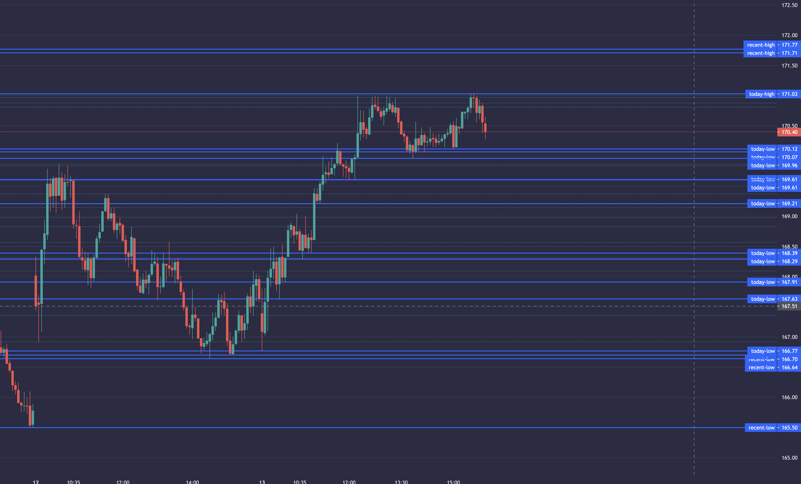

# chart-with-lines

[Try it out!](https://jamesfulford.github.io/chart-with-lines/?token=&symbol=AAPL)



5m candles on an interactive chart. Lines are drawn from peaks and troughs of activity from last 180 calendar days, with special focus given to the last 7 calendar days. Lines that have been violated today become subtler.

## Try it out!

```bash
npx serve
```

(or serve from a server some other way and open in a browser)

Add two URL parameters:

`http://localhost:3000/?token=TOKEN&symbol=AAPL`

- `token`: API key from [Finnhub.io](https://finnhub.io). Free tier works great.
- `symbol`: Ticker symbol you want to see. ex: AAPL, TSLA, GME, XLE, etc. (make sure it's all-caps)

## Notes

- code.tar python scripts are a part of a private codebase I own
- finnhub.io HTTP error handling not implemented
